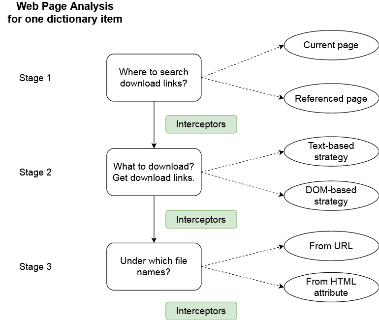

# Hosts Definitions

This page explains the available strategies to gather download links
for a given web site.

> Notice that having skills in Software Development is a serious asset here.  
> **Prior knowledge about XML, XPath and regular expressions really helps to understand this page.**


## Hosts.xml File

All the hosts definitions must be gathered in a single XML file.  
The location of this XML file can be defined in the extension's preferences.

The XML file contains a hierarchical structure that looks like...

```xml
<?xml version="1.0" encoding="UTF-8"?>
<root>

	<host id="host 1">
		<domain>...</domain>
		<path-pattern>...</path-pattern>
		<link-search-pattern>...</link-search-pattern>
	</host>
	
	<host id="host 2">
		<domain>...</domain>
		<path-pattern>...</path-pattern>
		<link-search-pattern>...</link-search-pattern>
	</host>

</root>
```

Each host has its own item.  
So, if you want to add a new host, you only have to add an item in such a file.
It is even possible for a host to be associated with several items. As an example...

```xml
<?xml version="1.0" encoding="UTF-8"?>
<root>

	<host id="instagram-pics">
		<domain>...</domain>
		<path-pattern>...</path-pattern>
		<link-search-pattern>...</link-search-pattern>
	</host>
	
	<host id="instagram-vids">
		<domain>...</domain>
		<path-pattern>...</path-pattern>
		<link-search-pattern>...</link-search-pattern>
	</host>

</root>
```

Just give the items a different ID.  
The ID is useful when there is an error to fix or an upgrade to perform.


## General Principle

Everything starts from analyzing the source code from the current page / browser tab.
There are 3 stages in this analysis:

1\. Where do we want to search download links?
  * In the current page?
  * In a page referenced on the current one?

This is what the **domain** and **path-pattern** properties are used for.
They allow to define which (other) pages should be analyzed to find download links. 

2\. Once we know which pages we have to analyze, we can start searching links.
This is achieved with the **link-search-pattern** and **link-attribute** properties.
The search pattern can...

  * ... either make a text-search (`expreg`, `replace`, `self` strategies).
  * ... or analyze the DOM document of the HTML page (`ID`, `class`, `XPath`, `CSS query` strategies). In this case, the search pattern helps to find a HTML element and the **link-attribute** selects which HTML attribute consider.

3\. Once download links have been found, we can consider the file name that will be used to save the target file. By default, it is deduced from the download URL, but for DOM-based strategies, it can also be retrieved from another HTML attribute. As an example, if one used the `XPath` strategy to find `img` elements, the download link can be retrieved with the `src` attribute and the file name from the `alt` (or `title`) attribute.

4\. Eventually, between all these stages, it is possible to use interceptors. Interceptors can rewrite information by replacing parts of it. An interceptor can:

  * ... update where to search download links.
  * ... rewrite download links before they are stored.
  * ... fix the target file name. 

Therefore, defining a dictionary item just specifies a sequential processing workflow that starts with the analysis of the current web page and leads to downloading files.
 
We can summarize it with the diagram below.



Everytime this extension is used, all the dictionary rules are applied on the page. It can be used to retrieve any kind of file (even if the official dictionary focuses on images and media files). This dictionary is defined in a XML file, as shown in the previous section. You will find below more details about the different properties it can contain.


## Domain

### Simple Domains

The domain is the one of the links we want to discover and explore.  
As an example, if you want to explore links that point to `http://toto.net`, the domain
name is `toto.net`.

```xml
<domain>toto.net</domain>
```

When you define a domain, HG ++ will consider all the links with *http*, *https*,
*www.* prefixes, as well as sub-domains. The value of a domain is a text. **Not a regular expression**.


### Specific Rule (not restricted to any domain)

If the rule definition targets a tool that can appear on several web sites, you can use
the `_$ANY$_` value.

```xml
<domain>_$ANY$_</domain>
```

This is what the [Coppermine](http://coppermine-gallery.net/) uses in the default catalog.
Many web sites run such a gallery system. The Coppermine rule indicates we should apply it
to every web site, not for a single domain. When a web page is analyzed, the `_$ANY$_`
value means we use **the host name of the current page**.

If we keep the Coppermine example, let's imagine we have such a gallery hosted on
*toto.net*. If we visit this web site, IHG ++ will find all the media
hosted on *toto.net* by using the Coppermine rule. But if somewhere in the page, there
is a reference to another Coppermine gallery (e.g. a link to *other-web-site.com*), then
it will be skipped.

The `_$ANY$_` value applies to a several domains.  
But within the scope of a single page, it will only apply to this domain.


### Regular Expressions for Domain

It is possible to use a regular expression for domains.  
But you have to use a `domain-pattern` mark-up instead.

```xml
<domain-pattern>toto\d+\.net</domain-pattern>
<!--
This example will match all the derivating domains that end with an integer:
toto1, toto2, toto24, toto548, etc.
-->
```

Just like for a domain, *http*, *https*, *www.* prefixes and sub-domains
will be managed automatically. Unlike the `_$ANY$_` value, this rule
will accept any link that matches the domain pattern, no matter what is the
current web page.


## Path Pattern

The path pattern **helps to find what to explore** on a given domain.  
It accepts 2 kinds of values.


### Find Links to Explore

This includes the case where you want to find pages to explore
from the current one. In this situation, the path pattern must be a
[regular expression](https://developer.mozilla.org/en-US/docs/Web/JavaScript/Guide/Regular_Expressions).
Basically, when you visit a web page and activates Host Grabber, it analyzes the source code.
All the text parts that match the domain and path pattern will be kept for further analysis.

As an example, if you are visiting a forum with images, the URL pattern will help to find
the links that lead to the web sites that host these images.

It is not in this guide's objectives to explain what a regular expression is.  
However, here is an example of URL pattern to find pages hosted by *my-image-host*.

```xml
<path-pattern>.+\.jpg</path-pattern>
```

There are some rules to know when setting this property

* It cannot start with `/`.
* It cannot start with `^`.
* It cannot end with `$`.
* The `.` symbol will be replaced by `[^<>"]`.
* To get the `.` symbol, one should write `&dot;`.
* The HTML entity for `<` must be written `&lt;`.
* The HTML entity for `>` must be written `&gt;`.
* The HTML entity for `&` must be written `&amp;`.


### Explore the Current Page Only

Using a regular expression allows to find what pages to explore.  
But sometimes, you just want to explore the current page.
`_$CURRENT$_` is the solution then.

It allows to apply search patterns (XPath, replace, etc) on the current page.


## Link Search Patterns

The path pattern allows to find what to explore.  
**The search pattern allows to find download links once we know what to explore.**
And there are several strategies. Some are more greedy than others. Let's take a look at them.

* [Self](#self)
* [Replace](#replace)
* [ID](#id)
* [Class](#class)
* [XPath](#xpath)
* [Expreg](#expreg)
* [CSS Query](#css-query)


### SELF

This is the most simple strategy.  
It considers the URL pattern allows to find what to download.

**Reference syntax:** `self` (case-insensitive)  
**Example:** embedded images in pages.

```xml
<domain>toto.com</domain>
<path-pattern>.*\.(jpg|png|gif)</path-pattern>
<link-search-pattern>SELF</link-search-pattern>
```

The URL pattern here allows to find all the JPG, PNG and GIF images referenced in the page.  
And **self** means we directly download them. No need to search further.


### Replace

This is another non-greedy strategy.  
It assumes we can find a download link from the matches we found with the URL pattern.

**Reference syntax:** `replace: 'regular expression to search', 'replacement string'` (case-insensitive)  
**Example:** image gallery with thumbnails.

```xml
<domain>toto.com</domain>
<path-pattern>.*\.(jpg|png|gif)</path-pattern>
<link-search-pattern>replace: 'tn_', ''</link-search-pattern>
```

The URL patterns identifies images, that may be thumbnails.  
And the search pattern replaces parts of the URL to lead to the real image.

Notice you can use regular expressions for the search.

```xml
<domain>toto.com</domain>
<path-pattern>.*\.(jpg|png|gif)</path-pattern>
<link-search-pattern>replace: 'images/thumbs/([^/]+)/tn_(.*)', 'images/originals/$1/$2'</link-search-pattern>
```

With such a search pattern, a thumbnail located at `http://toto.com/images/thumbs/november-2017/tn_01.jpg`
would be resolved to `http://toto.com/images/originals/november-2017/01.jpg`. **$1** and **$2** are references
to the captured groups (the segments in-between brackets).


### ID

ID is a greedy-strategy.  
It considers the link found by the URL pattern must be downloaded and analyzed.

> Except if the [path pattern points to the current tab](#current-page). 

As an example, if the URL pattern identified a link to *my-image-host*, then Host Grabber
follows the link and downloads the page. It then analyzes it to extract the information. Here,
the link is found by searching an image whose HTML ID is the one given in the search pattern. As a reminder,
a HTML ID is supposed to be unique within a page.

**Reference syntax:** `ID: the html id` (case-insensitive)  
**Example:** many web image hosts.

```xml
<domain>image-host.com</domain>
<path-pattern>view\.php\?.*\.(jpg|png|gif)</path-pattern>
<link-search-pattern>ID: image</link-search-pattern>
```

Assuming this URL pattern finds a set of links that look like `http://image-host.com/view.php?01.jpg`,
Host Grabber will follow all of them, download the pages and analyze them. Each page having a HTML element
with the specified ID with result in an item to download.


### Class

Class is a greedy-strategy.  
It considers the link found by the URL pattern must be downloaded and analyzed.

> Except if the [path pattern points to the current tab](#current-page).

As an example, if the URL pattern identified a link to *my-image-host*, then Host Grabber
follows the link and downloads the page. It then analyzes it to extract the information. Here,
the link is found by searching an image whose HTML class is the one given in the search pattern.
All the **img** elements with the specified class will be downloaded.

**Reference syntax:** `Class: the html class` (case-insensitive)  
**Example:** many web image hosts.

```xml
<domain>image-host.com</domain>
<path-pattern>view\.php\?.*\.(jpg|png|gif)</path-pattern>
<link-search-pattern>Class: image</link-search-pattern>
```

Assuming this URL pattern finds a set of links that look like `http://image-host.com/view.php?01.jpg`,
Host Grabber will follow all of them, download the pages and analyze them. Each page having HTML elements
with the specified class with result in items to download.


### XPath

XPath is a greedy-strategy.  
It considers the link found by the URL pattern must be downloaded and analyzed.

> Except if the [path pattern points to the current tab](#current-page).

As an example, if the URL pattern identified a link to *my-image-host*, then Host Grabber
follows the link and downloads the page. It then analyzes it to extract the information. Here,
links are found by searching a HTML element or attribute with a [XPath expression](https://wikipedia.org/wiki/XPath).

**Reference syntax:** `XPath: a XPath expression` (case-insensitive)  
**Example:** many web image hosts.

```xml
<domain>image-host.com</domain>
<path-pattern>view\.php\?.*\.(jpg|png|gif)</path-pattern>
<link-search-pattern>XPath: //div[@class=image-container]/img</link-search-pattern>
```

Assuming this URL pattern finds a set of links that look like `http://image-host.com/view.php?01.jpg`,
Host Grabber will follow all of them, download the pages and analyze them. The download links will be found
by searching an **img** mark-up, located under a **div** with the **image-container** class.

Notice that the **Class** and **ID** strategies are shortcuts to the **XPath** strategy.


### Expreg

Expreg is a greedy-strategy.  
It considers the link found by the URL pattern must be downloaded and analyzed.

> Except if the [path pattern points to the current tab](#current-page).

As an example, if the URL pattern identified a link to *my-image-host*, then Host Grabber
follows the link and downloads the page. It then analyzes it to extract the information. Here,
links are found by searching with a regular expression.

**Reference syntax:** `Expreg: a regular expression` (case-insensitive)  
**Example:** many web image hosts.

```xml
<domain>image-host.com</domain>
<path-pattern>view\.php\?.*\.(jpg|png|gif)</path-pattern>
<link-search-pattern><![CDATA[expreg: <meta property="og:image"\s+content="([^"]+)"]]></link-search-pattern>
```

Assuming this URL pattern finds a set of links that look like `http://image-host.com/view.php?01.jpg`,
Host Grabber will follow all of them, download the pages and analyze them. The download links will be found
with a regular expression. If a capture group is defined, its content will be resolved as the download link.
If there is no capture, then the entire match is kept. Here is an example to illustrate this case (there is no
bracket in the regular expression).

```xml
<domain>image-host.com</domain>
<path-pattern>view\.php\?.*\.(jpg|png|gif)</path-pattern>
<link-search-pattern><![CDATA[expreg: http://.*/big/.*\.jpg]]></link-search-pattern>
```

Here, it will only keep JPG images located in the **big** directory.

> You might have notice a CDATA section in these last examples.  
> There are used to prevent invalid characters in XML.


### CSS Query

CSS Query is a greedy-strategy.  
It considers the link found by the URL pattern must be downloaded and analyzed.

> Except if the [path pattern points to the current tab](#current-page).

As an example, if the URL pattern identified a link to *my-image-host*, then Host Grabber
follows the link and downloads the page. It then analyzes it to extract the information. Here,
links are found by searching **img** elements with a [CSS query](https://www.w3schools.com/cssref/css_selectors.asp).

**Reference syntax:** `CSS query: a CSS query` (case-insensitive)  
**Example:** many web image hosts.

```xml
<domain>my-image-host.com</domain>
<path-pattern>view\.php\?.*\.(jpg|png|gif)</path-pattern>
<link-search-pattern>CSS query: div.col-md-12 img</link-search-pattern>
```

Assuming this URL pattern finds a set of links that look like `http://my-image-host.com/view.php?01.jpg`,
Host Grabber will follow all of them, download the pages and analyze them. The download links will be found
by searching an **img** mark-up, located under a **div** with the **col-md-12** class.

To use the `>` selector in a CSS query, it must be replaced by `&gt;`.  
Example: `div.col-md-12 &gt; img` will be interpreted as `div.col-md-12 > img`


### Current Page

If the path pattern has the special value `_$CURRENT$_` and that the current web page matches
the domain, then search patterns are applied on the current page. It means there is no additional
link to explore, we explore the current page.

In this example...

```xml
<domain>toto.com</domain>
<path-pattern>_$CURRENT$_</path-pattern>
<link-search-pattern>CLASS: img</link-search-pattern>
```

... if we are visiting a page from the *toto.com* domain, we will search for all the images
whose CSS class is *img*. It works with all the search pattern strategies.


## Link Attribute

The link search pattern allows to find links.  
When this search is based on a DOM analysis, it must target a HTML element. It means it must be completed with a HTML attribute and this is what this property is used for. 

```xml
<domain>toto.com</domain>
<path-pattern>_$CURRENT$_</path-pattern>
<link-search-pattern>CLASS: img</link-search-pattern>
<link-attribute>src</link-attribute>
```

The link attribute property is optional and only makes sense for the `ID`, `class`, `XPath` and `CSS query` strategies. It allows to specify the HTML attribute to get the download link. By default, it is `src` (which is why this property is optional).


## File Name Attribute

The file name attribute property is optional and has two roles.

First, for the `ID`, `class`, `XPath` and `CSS query` strategies, it allows to specify the HTML attribute to get the file name. Since these strategies target HTML elements, we can retrieve the file name from one of its attribute. As an exemple, several web hosts for images generate random file names for links and put the original file name in the `alt` or `title` attribute. In this case, we could use this mark-up and set its value to `alt` or `title`. If not specified, the file name will be deduced from the URL. 

```xml
<domain>toto.com</domain>
<path-pattern>_$CURRENT$_</path-pattern>
<link-search-pattern>CLASS: img</link-search-pattern>
<link-attribute>src</link-attribute>
<file-name-attribute>alt</file-name-attribute>
```
 
It can also be used to define interceptors on the file name (even for strategies that do not rely on the DOM analysis, such as `self`, `expreg` and `replace`). When this property has the empty value, it simply indicates to use the default name (deduced from the URL).

```xml
<domain>toto.com</domain>
<path-pattern>_$CURRENT$_</path-pattern>
<link-search-pattern>CLASS: img</link-search-pattern>
<link-attribute>src</link-attribute>
<file-name-attribute></file-name-attribute>
<interceptor>replace: '\.jpeg', '.jpg'</interceptor>
```


## Interceptors

HG ++ explores web pages to discover download links. But sometimes, the
URL we find are not exactly those we want. Sometimes also, web sites might
change their domain address. This is very rare. And still it is what happened
to PixHost. It used to be reachable to **pixhost.org**. At the beginning of 2018,
it lost its domain and had to adopt **pixhost.to**.

Anyway, Host Grabber ++ provides a redirection mechanism.
It can be used, as an example, to redirect from an ancient domain to a new one. Or to target
something we know but could not find.

Here is an example...  
When it finds a link that points to pixhost.org, it will inspect the right page
but on pixhost.to.

```xml
<host id="pixhost-org">
	<domain>pixhost.org</domain
	<path-pattern>show/.+</path-pattern>
	<interceptor>replace: '\.org/', '.to/'</interceptor>
	<link-search-pattern>ID: image</link-search-pattern>
</host>
```

The interceptor replaces a part of the URL by another one.  
The syntax is the same than [the replace directive in search patterns](#replace).

An interceptor may appear in several locations.

* After a **path-pattern** mark-up: replacement will be done on the found links, those that must be explored.
* After a **link-search-pattern** mark-up: replacement will be done on the links found after exploration.
* After a **file-name-attribute** mark-up: replacement will be done on the file name (no matter where it is found).

You can define several interceptors if necessary.

```xml
<host id="pixhost-org">
	<domain>pixhost.org</domain>
	<path-pattern>show/.+</path-pattern>
	
	<!-- Explore another page that the one found in the current tab. -->
	<interceptor>replace: '\.org/', '.to/'</interceptor>
	<interceptor>replace: 'show/', 'view/'</interceptor>
	<link-search-pattern>ID: image</link-search-pattern>
	
	<!-- We found links to thumbnails in the document. Redirect to bigger images. -->
	<interceptor>replace: '_tn\.jpg', '_big.jpg'</interceptor>
</host>
```

Because exploration could be end-less, we fixed a limit to the recursive approach. There might be pages
or web sites for which combining search patterns and interceptors may not be enough. But this provides
enough flexibility for most of the situations.
 

## Relative Links

Relative links are resolved against the web page where they were found.  
Therefore, they are handled correctly.


## Troubleshooting

**Everything is correct and should work, but it does not.**

It may happen that everything is correct and still does not work.  
A possible reason, although it is unlikely, is that a catalog entry contains
invisible characters. Such a case was reported [here](https://github.com/rhadamanthe/host-grabber-pp/issues/49).
Type in the catalog entry from zero, without copy-paste, and test it once again.
