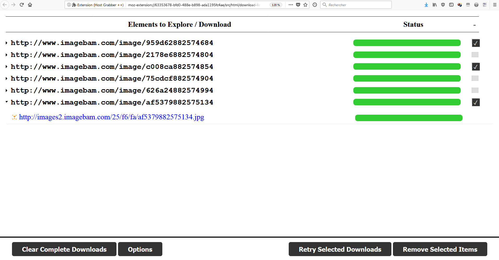
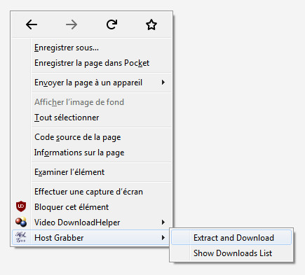
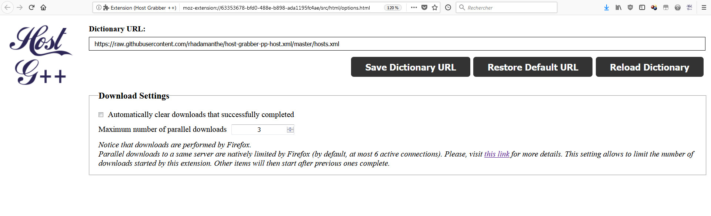

# Host Grabber ++

Host Grabber is a web extension to find and download media files from a web page.

It was originally designed for [Mozilla Firefox](https://www.mozilla.org/firefox/new/).
It is somehow the successor of [Image Host Grabber](https://addons.mozilla.org/fr/firefox/addon/imagehost-grabber/),
with some differences thought:

* It is not restricted to images.
* It does not check for MIME types.
* It is a little more strict in terms of what can specified in **hosts.xml** files (no function).
* It has much more less options, for the moment. It is not planned to restore all the
options that existed before.


## Screenshots

> The project is still in **beta** version.








## Installation

You can install it from [addons.mozilla.org](https://addons.mozilla.org/fr/firefox/addon/host-grabber-pp/).


## Usage

Simply browse a web page and right-click anywhere.  
Then, click **Host Grabber &gt; Extract**.

Host Grabber will then analyze the source code, explore its content
and finds download links. Once this step is complete, downloading starts.

The analysis is performed against a dictionary that defines what and how to
find download links.


## Preferences

Here is a short description of the preferences.

* **Catalog URL**: the default dictionary is hosted [here](https://raw.githubusercontent.com/rhadamanthe/host-grabber-pp-host.xml/master/hosts.xml).  
You can define your own one if you want and specify it through the extension preferences.
* **Hide downloads that successfully completed**: this option hides from the download view
all the downloads that were successful. Those with failures will remain visible.
* **Limit the number of simultaneous downloads**: this option allows to limit the number of
parallel downloads started by HG ++. Notice that by default, Firefox already limits the number
of active connections towards a same server (by default,
[this value](https://support.mozilla.org/fr/questions/992338) is 6).


## Notice

**This web site is not about managing a centralized list of hosts**.
You can fork [the original list](https://github.com/rhadamanthe/host-grabber-pp-host.xml),
add your own hosts and contribute them through a pull request.

As the author of the extension, I will upgrade the web extension itself.  
However, I do not intend nor want to manage everybody's list. So, it is highly possible that
a better list of hosts appears somewhere else.


## Hosts Definitions

[This page](hosts-definition.html) explains the various strategies available to find media files to download on a web page.


## Reuse by other Web Extensions

The first use case for this extension is to be invoked by a user through a menu
or a shortcut. However, it may also be used by other web extensions through an API.
They can indeed send a request to HG ++ so that it explores a given URL and downloads
media files from it.

Here is a sample code showing how to invoke HG ++ from your own extension.  
Notice that IG ++ does not return any response, it only explores the URL,
opens its downloads view and the retrieve the media files it found.

```javascript
browser.runtime.sendMessage(
  '{1a70f086-e7b8-43da-8171-e3e5c532ad4f}',
  {
    req: 'explore-page',
    page: 'The URL of the page to explore.'
  }
);
```


## Bugs, Feature Requests...

No bugs or feature request can be reported for the **hosts.xml** file.  
For the extension itself, you can submit them [here](https://github.com/rhadamanthe/host-grabber-pp/issues).


## Links

* [Source code](https://github.com/rhadamanthe/host-grabber-pp)
* Download from [addons.mozilla.org](https://addons.mozilla.org/fr/firefox/addon/host-grabber-pp/)
* [Release notes](https://github.com/rhadamanthe/host-grabber-pp/releases)
* Chat on [Gitter](https://gitter.im/host-grabber-pp/Lobby)
* Original **hosts.xml** file on [Github](https://github.com/rhadamanthe/host-grabber-pp-host.xml/blob/master/hosts.xml)
