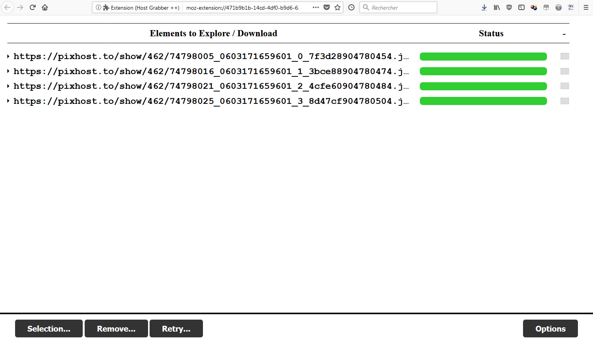
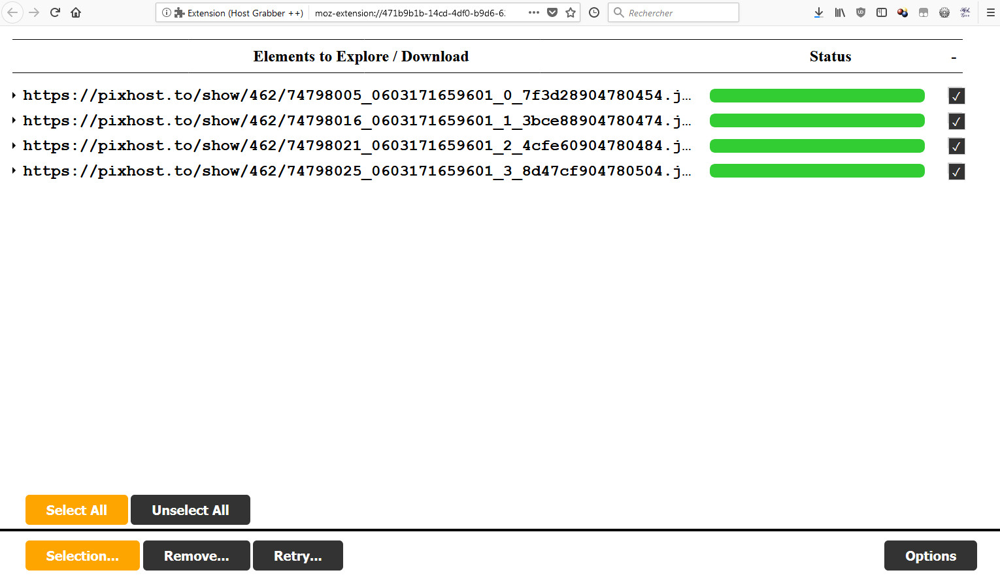
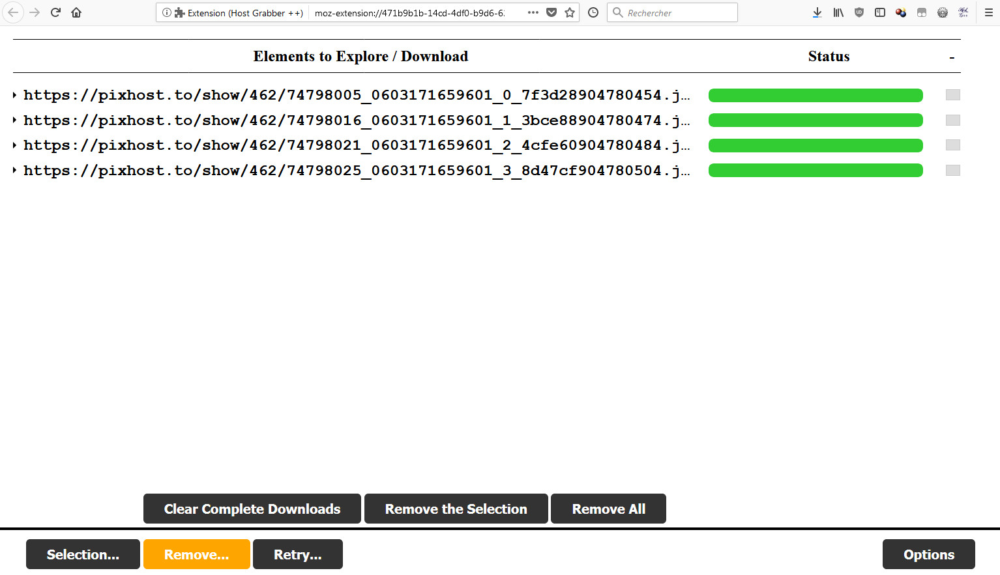
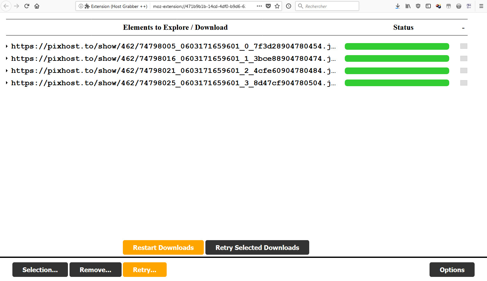
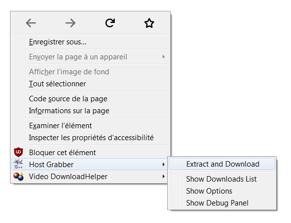
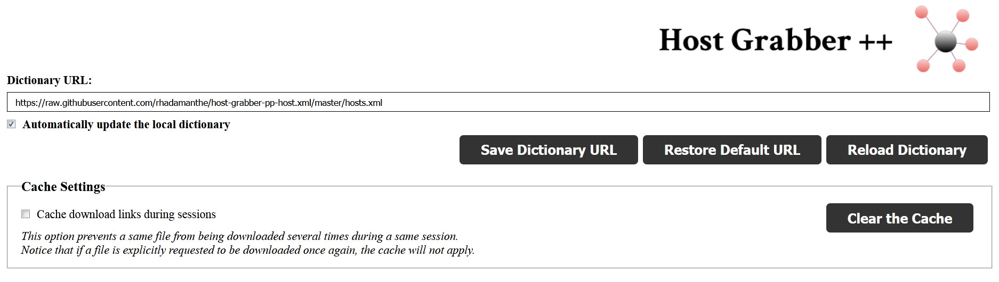
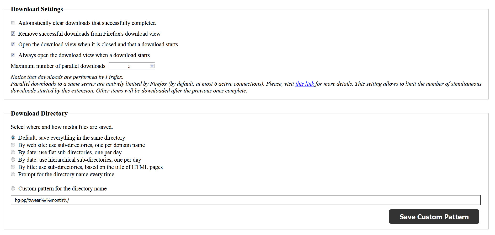
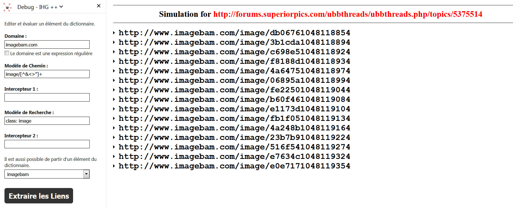

Host Grabber est une extension web qui extrait et télécharge des fichiers média depuis une page web en cours de visite.

Elle a été conçue à la base pour [Mozilla Firefox](https://www.mozilla.org/firefox/new/).
Elle est en quelque sorte le successeur de [Image Host Grabber](https://addons.mozilla.org/fr/firefox/addon/imagehost-grabber/),
avec quelques différences:

* Host Grabber ++ ne se limite pas à la récupération d'images.
* Le type MIME des fichiers téléchargés n'est pas vérifié.
* Le contenu du fichier **hosts.xml** est plus strict (pas de fonction).
* Les options sont limitées. Il n'est pas prévu de remettre toutes celles que possèdait *Image host Grabber*.


## Captures d'Écran
















## Installation sur Firefox &nbsp; 

Vous pouvez installer cette extension depuis [addons.mozilla.org](https://addons.mozilla.org/fr/firefox/addon/host-grabber-pp/).    
A partir de la version 0.7, un panneau latéral s'ouvre la première fois.
Vous pouvez le fermer sans inquiétude. Par défaut, Firefox ouvre le panneau latéral de
toute extension nouvellement installée qui en aurait un.


## Installation sur Chrome / Chromium &nbsp; 

**Cette extension est en version alpha pour Chrome / Chromium.**  
**Le panneau de débogage n'est disponible qu'avec Firefox.**

> Cette extension n'est PAS disponible sur le Chrome store.  
> La raison à cela est que le développeur du projet n'a pas l'intention de payer
> les frais d'inscription demandés par Google. Il ne s'agît pas la somme (dérisoire :
> 5$), mais d'une question de principe. Cette extension est gratuite, il n'est
> pas question de payer Google pour la distribuer.

Pour installer cette extension sur Chrome, téléchargez
[la dernière version](https://github.com/rhadamanthe/host-grabber-pp/releases),
ouvrez un nouvel onglet et tapez `chrome://extensions` dans la barre d'adresse,
puis finissez en tapant la touche **Entrée**.

Pour finir, faîtes glisser l'archive ZIP téléchargée dans cet onglet.  
Elle devrait être marquée comme installée.

* Après installation ou mise à jour de l'extension, il faut soit redémarrer Chrome,
soit rafraîchir les onglets existants (via F5) afin que l'extension fonctionne avec
les pages déjà chargées. Chrome ne réinjecte pas certains scripts automatiquement,
contrairement à Firefox.

* Pour que cette extension fonctionne dans de bonnes conditions avec Chrome,
il faut modifier les préférences de téléchargement, afin que Chrome sauvegarde
les fichiers téléchargés dans un même dossier, et surtout, que le téléchargement
se fasse automatiquement, **sans demander où sauvegarder les fichiers**.
[Un bug a été reporté auprès de l'équipe de Chrome](https://bugs.chromium.org/p/chromium/issues/detail?id=417112),
qui permettrait de contourner cette obligation. N'hésitez pas à voter pour ce ticket,
cela pourrait accélérer sa résolution. 


## Utilisation

Visitez la page web de votre choix, and faîtes un clic droit n'importe où.  
Puis cliquez sur **Host Grabber &gt; Extraire**.

Host Grabber analyse alors le code source de la page, explore son contenu and
extrait les liens de téléchargement. Les fichiers sont ensuite téléchargés. L'analyse
effectuée s'appuie sur un catalogue qui précise comment trouver les liens de téléchargement.

Il est également possible de télécharger les liens directs vers des images,
ainsi que de n'analyser qu'une portion sélectionnée de la page.


## Préférences

Voici une présentation des préférences disponibles.

* **URL du catalogue** : le catalogue par défaut est hébergé [ici](https://raw.githubusercontent.com/rhadamanthe/host-grabber-pp-host.xml/master/hosts.xml).  
Vous pouvez définir le vôtre et le référencer dans les préférences de l'extension.
* **Mettre à jour le catalogue automatiquement** : si activée, retélécharge le dictionnaire à chaque lancement
de Firefox. Autrement, le dictionnaire est stocké localement une première fois. Cette copie locale ne pourra
alors être mise à jour que manuellement, au travers de la page d'options.
* **Masquer les téléchargments terminés avec succès** : cette option enlève automatiquement de la vue
des téléchargements, tous ceux qui se sont terminés avec succès. Ceux avec des échecs resteront visibles.
* **Enlever les téléchargements réussis de la liste des téléchargements de Firefox** : cette option enlève de la vue
des téléchargements <strong>de Firefox</strong>, tous ceux qui se sont terminés avec succès. Ceux avec des échecs resteront visibles.
* **Ouvrir la vue des téléchargements quand une page est analysée** : par défaut, cette vue s'ouvre chaque fois
qu'une page est analysée. Ce comportement peut être modifié.
* **Limiter le nombre de téléchargements simultanés** : cette option permet de limiter
le nombre de téléchargements lancés par HG ++. Il faut noter aussi que Firefox limite de toute
façon le nombre de connexions simultanées vers un même serveur (par défaut,
[cette valeur](https://support.mozilla.org/fr/questions/992338) vaut 6).
* **Activer le cache de session** : cette option empêche un même fichier d'être téléchargé plusieurs fois
lors d'une même session. Ce cache peut être vidé, et même désactivé.
* **Répertoire de téléchargement** : par défaut, tout est téléchargé dans le même répertoire.
Mais il est possible de répartir les fichiers dans des sous-dissiers (par domaine, date, titre ou même personnalisé).

### Personnalisation des Sous-Répertoires

Voici les valeurs utilisables pour personnaliser le nom du répertoire
de téléchargement. Vous pouvez mêler ces valeurs avec des constantes pour constituer
le chemin que vous souhaitez.

| Valeur     | Description                                    |
| ---------- | ---------------------------------------------- |
| `%year%`   | Remplacée par l'année courante (4 chiffres).   |
| `%month%`  | Remplacée par le mois courant (2 chiffres).    |
| `%day%`    | Remplacée par le jour courant (2 chiffres).    |
| `%hour%`   | Remplacée par l'heure actuelle (2 chiffres).   |
| `%minute%` | Remplacée par la minute actuelle (2 chiffres). |
| `%domain%` | Remplacée par le nom de domaine de la page.    |
| `%title%`  | Remplacée par le titre de la page.             |

Exemple de nom personnalisé pour un sous-répertoire : `firefox/%year%-%month%/`  
Le nom ou chemin résultant sera toujours tronqué pour ne pas dépasser 160 caractères.


## Remarque

**Ce site n'a pas vocation de gérer une liste centralisée pour les hébergeurs**.
Vous pouvez cloner [la liste originale](https://github.com/rhadamanthe/host-grabber-pp-host.xml),
ajouter vos propres défintiions et les contribuer via une *pull request*.

En tant qu'auteur de l'extension, je maintiendrai et ferai évoluer l'extension.  
En revanche, je ne compte pas m'occuper de la liste des hôtes. Il est donc probable qu'une meilleure liste
fera son apparition quelque part ailleurs.


## Définitions des Hôtes

[Cette page](definition-des-hotes.html) explique les stratégies possibles pour trouver les fichiers à télécharger
sur une page web.


## Débogage



Dans Firefox, un panneau de débogage est disponible, pour créer, éditer et tester des
règles de dictionnaire. Il est accessible au travers du menu **Host Grabber &gt; Panneau de Débogage**.

Ce panneau reste ouvert quel que soit l'onglet.  
Il suffit alors de charger une règle, puis de visiter une page sur laquelle la tester.
En cliquant sur le bouton **Extraire les Liens**, la page est analysée au regard de cette
unique règle. Les liens sont extraits, et affichés dans une vue à part, mais rien n'est téléchargé.
Il s'agît de faciliter l'écriture de règles pour le dictionnaire. 


## Réutilisation par d'Autres Extensions Web

Le cas nominal d'utilisation de cette extension concerne une personne qui
lance une exploration par clic droit ou raccourci clavier. Toutefois, HG ++
propose aussi une API pour les autres extensions web. Cette API permet de lancer
HG ++ et d'explorer une URL donnée pour y découvrir et télécharger des fichiers média.

Voici un exemple de code pour utiliser cette API.  
Notez que HG ++ ne retourne aucune réponse. Il explore l'URL, ouvre sa
vue des téléchargements et récupère les liens découverts.

```javascript
browser.runtime.sendMessage(
  '{1a70f086-e7b8-43da-8171-e3e5c532ad4f}',
  {
    req: 'explore-page',
    page: 'URL de la page à explorer.'
  }
);
```

## Bugs, Demandes d'Évolution...

Aucun ticket ne peut être créé pour le fichier **hosts.xml**.  
Les bugs et demandes d'évolution pour l'extension elle-même, peuvent être reportés [ici](https://github.com/rhadamanthe/host-grabber-pp/issues)


## Liens

* [Code source](https://github.com/rhadamanthe/host-grabber-pp)
* Téléchargement depuis [addons.mozilla.org](https://addons.mozilla.org/fr/firefox/addon/host-grabber-pp/)
* [Notes de livraisons](https://github.com/rhadamanthe/host-grabber-pp/releases)
* Salon de discussion sur [Gitter](https://gitter.im/host-grabber-pp/Lobby)
* Fichier **hosts.xml** original [sur Github](https://github.com/rhadamanthe/host-grabber-pp-host.xml/blob/master/hosts.xml)
